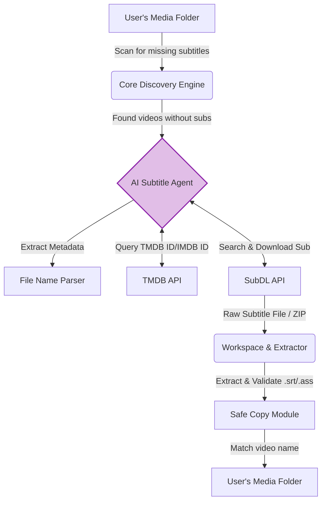

# Subtitle Agent 🎬

An AI agent that automatically finds, downloads, and organizes subtitles for your media collection using SubDL and TMDB.

## 🧠 How It Works

Subtitle Agent takes the hassle out of managing your media library by using advanced AI (Google's Gemini) to automatically find the perfect subtitles for your videos. 

**For Non-Developers:** You just point the agent to your folder full of movies or TV shows, and it does the rest. It looks at the file names, understands what show or movie it is, searches the internet for the right subtitle in your preferred language, and places it neatly next to your video file.

**For Developers:** Under the hood, this is a tool-calling AI agent. The core loop discovers video files without matching subtitle extensions (`.srt`, `.ass`, etc.). It then constructs a prompt for a Gemini model, providing tools to query the TMDB API for metadata and the SubDL API to download subtitle archives. The agent autonomously decides which tools to call, processes the results, extracts the subtitles from ZIP files, and safely moves them into your library using deterministic Python fallback functions to prevent arbitrary code execution or unsafe file paths.

### 🏗️ Architecture Overview



## ✨ Features

Whether you're looking for a simple tool to fix your movie folder or an elegant, AI-driven automation script, Subtitle Agent has you covered.

*   🎯 **Zero-Hassle Automatic Discovery:** Just point to a folder. It recursively scans and identifies exactly which `.mp4`, `.mkv`, or `.avi` files are missing their `.srt` or `.ass` companions. 
*   🤖 **True Agentic Search (AI-Powered):** Instead of using fragile regex or hardcoded scrapers, it uses the reasoning capabilities of Large Language Models to handle messy, inconsistently named downloaded media files.
*   🌍 **Universal Language Support:** Say "French" or "Spanish" in the command line, and the agent automatically maps it to API-compliant language flags for global subtitle search.
*   🛠️ **Safe & Secure Execution:** Designed with security in mind. It extracts archives into a temporary workspace and mathematically guarantees that files are only moved into safe, authorized directories.
*   🎬 **Deep Metadata Integration:** Directly interfaces with TMDB and SubDL to verify movies and TV shows, ensuring you get the *exact* subtitle for your specific media version.
*   🏗️ **Agent-First Architecture:** Built using OpenAI's Codex principles. Uses strict dependency layering, system-of-record documentation, and mechanical "doc-gardening" linters to permanently prevent AI architectural slop.
*   ⚙️ **Highly Customizable:** Bring your own Gemini model (defaults to lightweight, fast models) and configure custom behaviors directly via CLI flags.

## 🚀 Quick Start (For Everyone)

Don't want to deal with complex developer environments? Follow these simple steps:

1. **Get the Prerequisites:**
   - Install **Python** (version 3.14 or newer) from [python.org](https://www.python.org/downloads/).
   - Install **uv** (a fast Python package manager). Open your terminal/command prompt and run:
     - **Windows:** `powershell -ExecutionPolicy ByPass -c "irm https://astral.sh/uv/install.ps1 | iex"`
     - **Mac/Linux:** `curl -LsSf https://astral.sh/uv/install.sh | sh`

2. **Download the Agent:**
   - Download this project as a ZIP file (click the green "**Code**" button at the top of this page, then "**Download ZIP**") and extract it to a folder on your computer.
   - *Alternatively, you can use `git clone https://github.com/randall-liao/subtitle-agent.git` if you have Git installed.*

3. **Set Up Your API Keys:**
   - Open the extracted folder.
   - Create a new text file and name it exactly `.env` (make sure your computer doesn't name it `.env.txt`).
   - Open it in Notepad or any text editor and paste your API keys like this:
     ```env
     GEMINI_API_KEY=your_gemini_key_here
     SUBDL_API_KEY=your_subdl_key_here
     TMDB_API_KEY=your_tmdb_key_here
     ```
   - *(See the **API Keys Setup** section below for how to get these free keys)*.

4. **Run the Agent:**
   - Open your terminal or command prompt **inside the extracted folder**.
   - Run the following command, replacing the path with the folder where your movies/shows are:
     ```bash
     uv run src/main.py --language "English" "C:\Path\To\Your\Media\Folder"
     ```

### ⚙️ Command Line Options
- `folder`: Directory to scan for missing subtitles.
- `--language`: (Required) Natural language for the subtitles (e.g., "English", "French", "Spanish"). 
- `--model`: Optionally specify a different Gemini model (defaults to `gemini-3.1-flash-lite-preview`).

---

## 💻 Advanced Setup (For Developers)

If you are a developer, you can quickly spin up the environment:

1. Clone the repository:
   ```bash
   git clone https://github.com/randall-liao/subtitle-agent.git
   cd subtitle-agent
   ```
2. Install dependencies using `uv`:
   ```bash
   uv sync
   ```
3. Run the custom mechanical enforcement linters (to ensure agentic constraints):
   ```bash
   uv run python scripts/lint_docs.py
   uv run python scripts/lint_architecture.py
   ```

---

## 🔑 API Keys Setup

To use the Subtitle Agent, you need to set up the following API keys in your environment (e.g., in a `.env` file):

1. **Gemini API Key (`GEMINI_API_KEY`)**
   - Go to Google AI Studio ([aistudio.google.com](https://aistudio.google.com/)).
   - Sign in and click "Get API key" on the left navigation to generate a new key.

2. **SubDL API Key (`SUBDL_API_KEY`)**
   - Go to [subdl.com](https://subdl.com/) and create an account.
   - After signing in, navigate to your account settings or profile page to generate and copy your API Key.

3. **TMDB API Key (`TMDB_API_KEY`)**
   - Go to [themoviedb.org](https://www.themoviedb.org/) and create an account.
   - Go to your Account Settings > API.
   - Request a "Developer" API key and fill in the required details. Once approved, copy the API Key (v3 auth).

## 📄 License

This project is licensed under the MIT License - see the [LICENSE](file:///home/devuser/projects/subtitle-agent/LICENSE) file for details.

## Credits

Special thanks to the authors of the CLI tools used in this project:
- **SubDL CLI**: [@kalmnoise](https://github.com/kalmnoise/subdl_api_cli)
- **TMDB CLI**: [@illegalbyte](https://github.com/illegalbyte/TMDB_CLI)

> **Note**: The CLI files in `src/cli/` are considered external/upstream code. They are not to be modified and are excluded from testing and coverage calculations.
