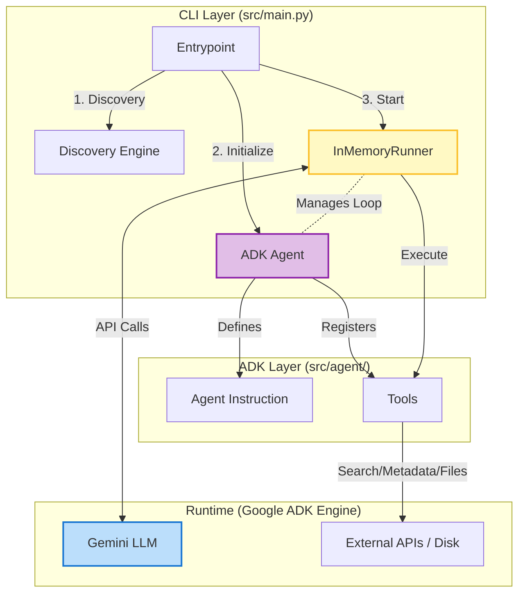
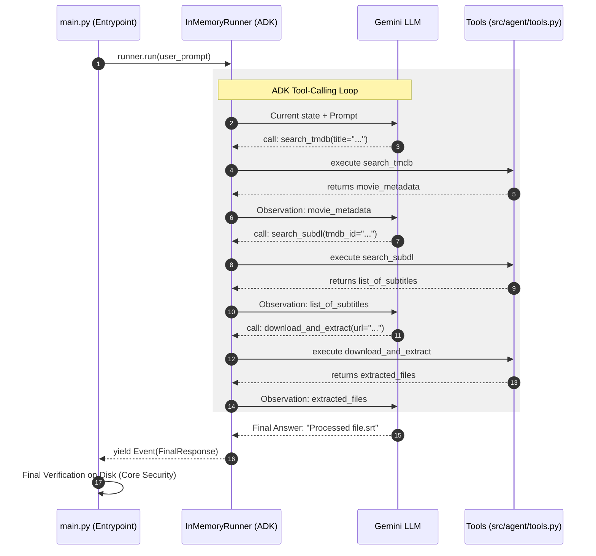

# ADK Integration Deep Dive

This document explains how the **Google Agent Development Kit (ADK)** is integrated into the Subtitle Agent project to handle autonomous tool orchestration.

## 🏗️ Structural Overview

The migration to ADK replaced a manual `while` loop that managed chat turns with a declarative `Agent` and a managed `Runner`.

## 🔄 Agentic Execution Flow

When you run `uv run src/main.py`, the following sequence occurs inside the ADK runtime. ADK abstracts the "thinking" and "doing" turns, allowing the LLM to decide the best path to find subtitles.

## 💎 Key Benefits of ADK

1.  **Deterministic Looping**: We no longer write `while True: chat.send_message()`. ADK handles retries, tool call resolution, and event streaming.
2.  **Native Function Calling**: ADK automatically converts Python type hints (e.g., `tmdb_id: str`) and docstrings into Gemini tool schemas.
3.  **Simplified Instruction**: The system instruction (in `prompt_logic.py`) no longer needs to explain *how* to call tools or provide XML planning tags. It just defines the *what* and the *rules*.
4.  **In-Memory State**: `InMemoryRunner` maintains a lightweight session history, allowing the agent to "remember" previous tool failures (e.g., if search by TMDB ID fails, it can try searching by title in the next turn).
